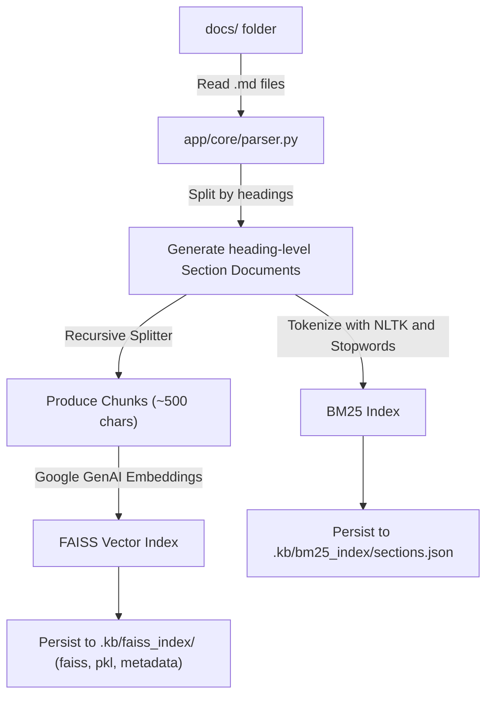
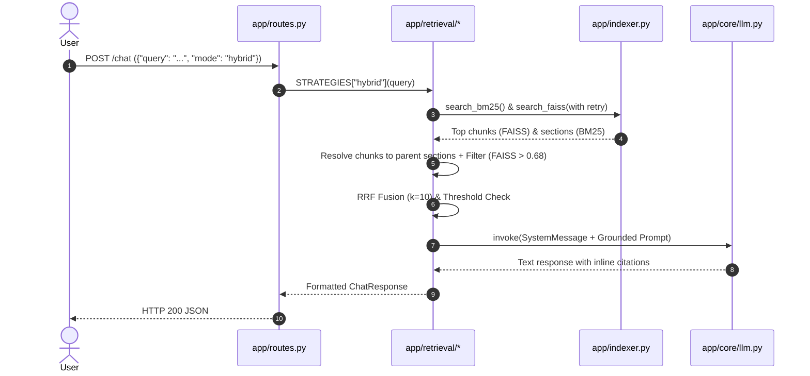

# Knowledge Base Q&A Bot

This repository contains an AI-powered documentation assistant designed to answer questions strictly grounded in a local markdown knowledge base. 

## Quick Start

1. Set up your Google Gemini API key:
   ```bash
   export GEMINI_API_KEY="AIzaSy..."
   ```

2. Start the application using `uv` (our standard project manager):
   ```bash
   uv run uvicorn app.main:app --reload
   ```

3. Open your browser to http://127.0.0.1:8000
4. Click **Index Knowledge Base** to process the markdown files in the `docs/` folder.
5. Use the chat interface to ask questions!

---

## Architecture Overview

### Executive Summary
The `knowledge-base-qa-bot` leverages a Hybrid Retrieval-Augmented Generation (RAG) architecture, combining exact keyword matching (BM25) with semantic vector search (FAISS + Google GenAI Embeddings), and fusing the results via Reciprocal Rank Fusion (RRF). 

The backend is built on FastAPI and LangChain, supporting a switchable retrieval strategy (BM25-only, Vector-only, or Hybrid) that allows users to perform comparative analytics and ensure high-fidelity citations back to the source markdown files.

### File Structure
```text
knowledge_base_qa_bot/
├── app/
│   ├── core/
│   │   ├── llm.py              # Gemini LLM and Embedding initialization
│   │   └── parser.py           # Markdown chunking and parent-section logic
│   ├── retrieval/
│   │   ├── bm25_search.py      # BM25 keyword retrieval strategy
│   │   ├── vector_search.py    # FAISS semantic retrieval strategy
│   │   ├── hybrid_search.py    # RRF fusion retrieval strategy
│   │   ├── common.py           # Shared prompting and evaluation logging
│   │   └── __init__.py         # Exported strategy router
│   ├── static/
│   │   └── index.html          # Vanilla JS UI (Bjork theme, Compare View)
│   ├── indexer.py              # Dual-index builder (BM25 + FAISS) with NLTK tokenization
│   ├── main.py                 # FastAPI application setup
│   ├── routes.py               # HTTP endpoints (/chat, /index, /health)
│   └── schemas.py              # Pydantic validation models
├── docs/                       # Markdown knowledge base files
├── evals/
│   ├── eval_set.json           # Evaluation queries and failure modes
│   └── run_eval.py             # Script to run metrics (Recall@K, MRR)
├── pyproject.toml              # Project dependencies and configurations
└── README.md                   # Setup and usage instructions
```

### Module Functionalities

#### `app/core/`
- **`parser.py`**: Extracts the knowledge base chunking logic. It parses markdown files by heading, creating full "section" documents with hierarchical `heading_path` tracking, and then uses a `RecursiveCharacterTextSplitter` to create smaller "chunks" (~500 chars), explicitly preserving the parent section ID for context resolution.
- **`llm.py`**: Centralizes the initialization of the `ChatGoogleGenerativeAI` model (`gemini-3.6-flash`) and `GoogleGenerativeAIEmbeddings` model (`models/gemini-embedding-2`).

#### `app/retrieval/`
- **`bm25_search.py`**: Implements exact-keyword search against the BM25 index. It returns full sections.
- **`vector_search.py`**: Implements semantic search against the FAISS index. It retrieves chunks and resolves them back to their full parent sections to avoid fragmented context.
- **`hybrid_search.py`**: Combines both BM25 and Vector results, filtering semantic matches with a FAISS threshold, and then re-ranking them using Reciprocal Rank Fusion (RRF, `k=10`) to provide the highest quality retrieved context. Includes confidence thresholds (e.g. 0.005) for fallback when outside knowledge bounds.
- **`common.py`**: Contains the `SYSTEM_PROMPT`, context formatting logic (`build_prompt`), and structured logging (`log_retrieval_event`) for observability.

#### `app/` (Root)
- **`indexer.py`**: Reads `docs/`, uses the core parser, and generates two in-memory indexes (BM25 and FAISS). Includes NLTK tokenization with stopword removal for BM25 and exponential backoff retry logic for the Gemini Embedding API. It handles persisting and loading these indexes from the `.kb/` directory to avoid re-embedding costs, serializing BM25 data to an explicit JSON schema (`sections.json`).
- **`main.py`**: Initializes the FastAPI app, manages CORS, configures static file mounting, and defines the lifecycle context (loads indexes on startup).
- **`routes.py`**: Defines the FastAPI endpoints. The `POST /chat` route dynamically delegates the query to the requested retrieval strategy (via the `mode` parameter).
- **`schemas.py`**: Defines the input and output models, including the `ChatRequest` (which accepts a `mode` string) and `ChatResponse`.

#### `app/static/`
- **`index.html`**: A lightweight, Vanilla HTML/JS frontend styled with a clean, minimalist "Bjork" theme. It supports a Strategy Switcher and a "Compare Mode" that fires three parallel requests to visualize how each retrieval strategy responds.

### API Endpoints

The backend provides the following FastAPI routes:

| Method | Endpoint | Description |
|--------|----------|-------------|
| **GET** | `/` | Serves the browser UI (`index.html`) |
| **GET** | `/health` | Health check to verify service is running |
| **POST** | `/index` | Rebuilds the dual indexes (BM25 + FAISS) from markdown files |
| **POST** | `/chat` | Performs hybrid retrieval and returns the generated LLM answer |
| **GET** | `/evaluate` | Runs the evaluation pipeline using the default evaluation set |


### Architecture & Data Flow

#### Indexing Flow (`POST /index`)


**Indexing Strategy (`app/indexer.py`)**: 
The application utilizes a **Parent-Child Hybrid Indexing Strategy** to balance exact keyword matching with semantic search while avoiding context fragmentation:
1. **Sections for BM25**: Markdown files are first parsed into full, heading-level logical blocks (Sections) keeping track of their hierarchical `heading_path`. These large blocks are directly indexed into an in-memory BM25 engine using NLTK tokenization and stopword removal to support robust exact-keyword matching.
2. **Chunks for FAISS (Semantic)**: The large sections are then recursively split into smaller chunks (~500 chars, with 50-char overlap) for high-density semantic vector embedding (FAISS). 
3. **Parent-Child Mapping**: Crucially, every chunk is tagged with the `parent_section_id` of its source section. When a vector search hits a chunk, the system uses this ID to resolve and retrieve the *full parent section*. This guarantees the LLM receives the complete surrounding context, successfully mitigating the "Wrong Retrieval Unit" failure mode (FM3).
4. **Persistence & Data Structures**: To avoid costly re-embedding (or re-tokenization) on every server restart, both the FAISS index and the BM25 sections are serialized and persisted to the local `.kb/` directory. 
   - **In-Memory (LangChain Documents)**: At runtime, the application natively operates on standard LangChain `Document` objects (`page_content` and `metadata` dict).
   - **On-Disk (`sections.json`)**: When persisting the BM25 index, LangChain documents are transformed into a strict, flat JSON schema (`id`, `file`, `heading_path`, `content`, `tokens`). This makes the index portable and bypasses tokenization on load.

#### Query/Response Flow (`POST /chat`)


### Dependencies & Tech Stack
- **Core Framework**: FastAPI (v0.115.6) & Uvicorn (v0.34.0)
- **AI/RAG Orchestration**: LangChain (v0.3.14) & LangChain Community
- **Vector Database**: FAISS CPU (v1.9.0.post1)
- **Keyword Search**: Rank-BM25 (v0.2.2), NLTK (for tokenization and stopwords)
- **Model Integrations**: LangChain Google GenAI (`models/gemini-embedding-2` and `gemini-3.6-flash`)
- **Validation**: Pydantic
- **Project Management**: `uv`

### Architectural Standards & Patterns
1. **Strict Grounding (Anti-Hallucination)**: The system prompt instructs the model to rely *only* on the provided context. If the best retrieved score falls below a threshold (`CONFIDENCE_THRESHOLD`), the backend intercepts and returns a predefined fallback response.
2. **Deterministic Citations**: Retrieved document chunks are tagged with a unique `filename#heading` identifier. The model must preserve these tags in its generated output to create verifiable links.
3. **Parent-Section Resolution**: Vector search inherently retrieves small chunks that lack context. The architecture enforces that every retrieved chunk is resolved back to its full parent markdown section *before* being fed to the LLM.
4. **Strategy Segregation**: Retrieval strategies are fully isolated into their own modules (`bm25`, `vector`, `hybrid`), allowing the UI and evaluation scripts to cleanly compare their performance without coupled logic.
5. **Resilience**: Downstream integrations (like Google GenAI Embeddings) are wrapped in exponential backoff retry logic to handle transient issues like rate limits gracefully.
