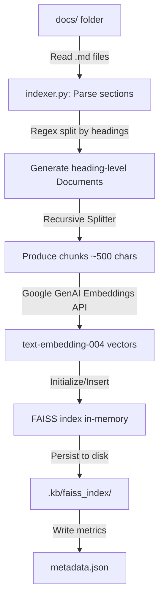
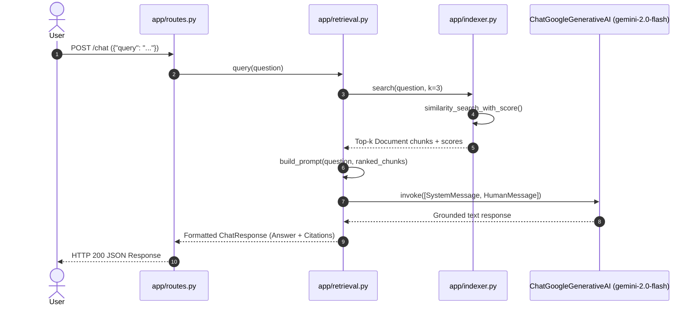

# Project Architecture Overview

## Executive Summary
The **Knowledge Base Q&A Bot** is a high-performance, grounded Retrieval-Augmented Generation (RAG) system built with **FastAPI** and **LangChain**. Its core mission is to provide accurate, source-cited responses to user queries based solely on a set of local Markdown documents (the canonical "Knowledge Base" stored under the `docs/` directory). The bot prevents hallucinations by strictly constraining answers to the retrieved text context and dynamically citing the exact source documents.

Architecturally, the project supports a **Vector RAG** strategy backed by **Google Gemini**. On the ingestion side, Markdown files are parsed by heading-level sections, split into semantic chunks, and embedded via Google's `text-embedding-004` model into a local **FAISS** vector store using `GoogleGenerativeAIEmbeddings`. The vector store is persisted locally to ensure rapid boot times and minimize API usage. On the query side, user inputs trigger semantic search over FAISS, and the top-scoring chunks are compiled into a structured context window for the `gemini-2.0-flash` model via `ChatGoogleGenerativeAI`, which generates the final source-grounded response.

## File Structure
```text
knowledge_base_qa_bot/
├── pyproject.toml         # uv project configuration and dependencies
├── uv.lock                # Locked exact dependency versions
├── main.py                # Root entry point stub
├── docs/                  # Canonical Knowledge Base (Markdown files)
│   ├── account_help.md    # User account FAQ
│   ├── refund_policy.md   # Order cancellations and refunds policy
│   └── shipping_faq.md    # Shipping timelines and tracking info
└── app/                   # Core FastAPI application module
    ├── __init__.py        # Package initialization
    ├── main.py            # FastAPI app initialization and startup hooks
    ├── routes.py          # API endpoint routes (/health, /index, /chat)
    ├── schemas.py         # Pydantic models for request/response validation
    ├── indexer.py         # Document parsing, chunking, and FAISS indexing
    └── retrieval.py       # RAG generation logic, prompting, and LLM query handler
```

## Module Functionalities
The application logic is modularized across specialized files to enforce separation of concerns, high cohesion, and low coupling:

### `app/`
- **`main.py`**: Initializes the `FastAPI` instance and registers the route router. It also sets up a `@app.on_event("startup")` hook to load any pre-existing, persisted FAISS index from disk when the server starts.
- **`routes.py`**: Defines public-facing HTTP endpoints:
  - `GET /health`: Liveness and readiness check.
  - `POST /index`: Triggers full knowledge base ingestion from `docs/`, building and persisting the vector database.
  - `POST /chat`: Receives query inputs, initiates retrieval, feeds retrieved context to the LLM, and returns the grounded answer.
- **`schemas.py`**: Declares Pydantic data schemas for strict type safety and input/output coercion:
  - `ChatRequest`: Validates incoming questions.
  - `ChatResponse`: Formats the structured answer and a list of sources.
  - `SourceInfo`: Encapsulates source metadata (`source` filename, exact `heading`, similarity `score`, and a text snippet).
  - `IndexResponse`: Details the count of processed files and sections.
- **`indexer.py`**: Orchestrates the data ingestion pipeline:
  - Parses `.md` files under `docs/` using regular expressions (`HEADING_RE`) to isolate heading sections and associate each with an exact Markdown anchor (e.g., `refund_policy.md#refund-timeline`).
  - Utilizes `RecursiveCharacterTextSplitter` from LangChain to safely partition sections into size-appropriate chunks (defaulting to 500 characters).
  - Interfaces with Google Gemini's `models/text-embedding-004` model via `GoogleGenerativeAIEmbeddings` to map text chunks into vector spaces, authenticated using the `GOOGLE_API_KEY` environment variable.
  - Instantiates, loads, saves, and queries a local memory-resident **FAISS** vector store under the `.kb/faiss_index/` directory.
- **`retrieval.py`**: Drives the retrieval and generation phases:
  - Interfaces with Google Gemini's `ChatGoogleGenerativeAI` client (defaulting to `gemini-2.0-flash` model), authenticated using the `GEMINI_API_KEY` environment variable.
  - Handles similarity searches against the active FAISS index, ranking and retrieving the top-`k` (default 3) relevant chunks.
  - Formulates the RAG context prompt by appending metadata headers (e.g., `[Source: filename#heading]`) to each retrieved chunk.
  - Defines the core `SYSTEM_PROMPT` containing hallucination defense instructions, instructing the LLM to only answer if the context contains sufficient evidence and fallback gracefully if it doesn't.

### `docs/`
- **`account_help.md`**: Houses account settings policies including instructions for changing email, resetting password, and deleting account.
- **`refund_policy.md`**: Outlines return/cancellation windows, non-refundable items, and refund processing timelines.
- **`shipping_faq.md`**: Clarifies standard and expedited shipping expectations and delivery tracking.

---

## Architecture & Data Flow

### 1. Ingestion Pipeline (`POST /index`)


### 2. Query/Response Flow (`POST /chat`)


---

## Dependencies & Tech Stack
- **Core Framework**: FastAPI (v0.115.6) & Uvicorn (v0.34.0) for high-performance HTTP request handling.
- **AI/RAG Orchestration**: LangChain (v0.3.14) & LangChain Community (v0.3.14) to coordinate prompt engineering, models, and retrieval.
- **Vector Database**: FAISS CPU (v1.9.0.post1) for fast in-memory semantic similarity search.
- **Model Integrations**: LangChain Google GenAI (`langchain-google-genai`) accessing Gemini models (`models/text-embedding-004` and `gemini-2.0-flash`).
- **Validation**: Pydantic (v2.x, bundled in FastAPI) for strict API input and output sanitization.
- **Project Management**: `uv` for python virtual environment, package synchronization, and execution.

---

## Architectural Standards & Patterns
1. **Strict Grounding (Anti-Hallucination)**: The system prompt instructs the model to rely *only* on the provided context. If the context is inadequate, the LLM must execute a predefined fallback response ("I cannot confirm from the knowledge base") instead of utilizing its pre-trained general knowledge.
2. **Deterministic Citations**: Retrieved document chunks are tagged with a unique `filename#heading` identifier. The model must preserve these tags in its generated output to create verifiable, deep links directly into the source document.
3. **Persisted Vector Store (Warm Starts)**: The memory index is dumped to `.kb/faiss_index/` and reloaded dynamically during server start, bypassing the need to pay for and wait for rebuilding embeddings on server reboots.
4. **Environment-Driven Configuration**: API keys (`GOOGLE_API_KEY` and `GEMINI_API_KEY`) and execution targets (like LLM models) are parsed strictly via environment variables, keeping credentials out of version control.
5. **Pydantic Type Coercion**: Handlers do not operate on raw JSON dictionaries; requests are parsed immediately into structured schemas for absolute runtime predictability.
